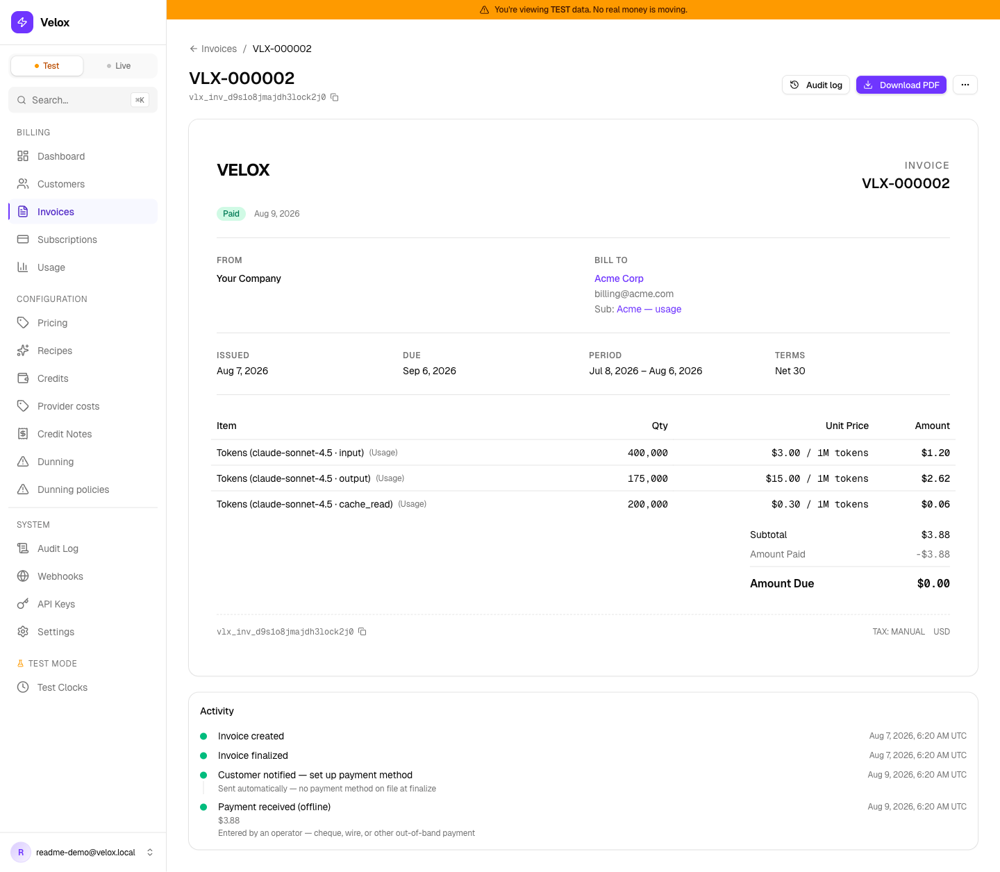

# Velox

### Meter every token. Sell commits. Know your margin.

**The open-source billing engine for AI and usage-heavy SaaS — runs in your own VPC.**

[](https://github.com/getvelox/velox/actions/workflows/ci.yml)
[](https://go.dev)
[](LICENSE)
[](CHANGELOG.md)

**Pre-1.0.** The public API is stabilising but not yet frozen — breaking changes land on MINOR until 1.0.0 ([versioning policy](CHANGELOG.md)).

---

## What it looks like

One meter, dimensioned events, and a month later this invoice exists — generated by `./scripts/demo.sh`, which runs the whole flow against a real deployment in ~30 seconds:

```text
ACME Corp — VLX-000001                                    $3.88
──────────────────────────────────────────────────────────────
Tokens (claude-sonnet-4.5 · input)       400,000    →   $1.20
Tokens (claude-sonnet-4.5 · output)      175,000    →   $2.62
Tokens (claude-sonnet-4.5 · cache_read)  200,000    →   $0.06
──────────────────────────────────────────────────────────────
Margin (billed $3.88 vs provider cost $1.28)            67.1%
```



Three things happened there that most billing stacks can't do:

- **One meter carried every token dimension** — `model × token_type` live on the event, not on a zoo of per-combination meters.
- **Prices are decimal per-unit and read the way the industry quotes them** — stored exactly ($3.00 / 1M tokens = $0.000003/token), billed linearly, displayed per-1M on the invoice, the hosted page, and the PDF.
- **The margin line is in-app** — Velox stamped the provider's cost onto every event at ingest, so "which customers lose us money?" is one API call, not a warehouse project.

**Jump to:** [Quick start](#quick-start) · [The wedge in code](#the-wedge-in-code) · [What's in the box](#whats-in-the-box) · [Benchmarks](#benchmarks) · [Why Velox exists](#why-velox-exists) · [How it fits](#how-it-fits) · [Will it take our volume?](#fewer-dependencies--but-will-it-take-our-volume) · [What Velox is not](#what-velox-is-not) · [Architecture](#architecture) · [Engineering](#engineering) · [Roadmap](#roadmap)

---

## Quick start

Prereqs: Docker, Go 1.26+, Node 22+ (dashboard), `jq` (demo script).

```bash
git clone https://github.com/getvelox/velox.git && cd velox

# Backend — Postgres + bootstrap demo tenant + operator user + API keys
cp .env.example .env # make dev reads it; the defaults work for local dev as-is
docker compose up -d postgres
make bootstrap       # prints operator email + password + secret-test, secret-live, publishable-test keys
make dev             # API on :8080

# Operator dashboard (separate terminal)
cd web-v2 && npm install && npm run dev
# → http://localhost:5173 — sign in with the email + password from bootstrap
```

Then run the end-to-end demo — the whole wedge in ~30 seconds: an Anthropic-style price matrix via one recipe call, LiteLLM-shaped token ingest, provider cost rates, a test clock that simulates a full billing month, a finalized invoice with per-`(model, token_type)` lines + PDF, and the margin report:

```bash
./scripts/demo.sh <vlx_secret_test_... from make bootstrap>
```

Every call in the script is checked — it fails loudly at the first API mismatch instead of pretending. Rerun it as often as you like; each run creates a fresh demo customer on its own test clock.

Testing **outbound webhooks** locally needs no tunnel: `python3 scripts/dev/webhook-sink.py` runs a receiver on `localhost:9099` that logs every delivery with its `Velox-Signature` header, so you can verify the HMAC offline. Paths under `/fail` return 500 to exercise the retry ladder. (Localhost delivery is allowed in development, refused in production.)

Self-host for real: single-VM Docker Compose — see [`docs/self-host.md`](docs/self-host.md). Helm/Terraform/multi-replica HA land when a design partner names which Kubernetes flavour they actually run; pre-emptively shipping three deployment shapes produced surface nobody was running.

---

## The wedge in code

Bill Anthropic-style multi-dimensional pricing with **one meter**, sell a prepaid commit against it, and read per-customer margin — five steps, no Stripe Billing objects. (API from `make dev`, key from `make bootstrap` — see [Quick start](#quick-start).)

```bash
# 1. Create one meter for "tokens"
curl -X POST http://localhost:8080/v1/meters \
  -H "Authorization: Bearer $VELOX_SECRET" \
  -d '{"key": "tokens", "name": "LLM tokens", "unit": "token"}'

# 2. Ingest events that carry the dimensions inline
curl -X POST http://localhost:8080/v1/usage-events \
  -H "Authorization: Bearer $VELOX_SECRET" \
  -H "Idempotency-Key: req_8f2c..." \
  -d '{
    "event_name": "tokens",
    "external_customer_id": "cust_acme",
    "quantity": "12450",
    "dimensions": {"model": "gpt-4", "token_type": "input"}
  }'

# 3. Define one pricing rule per (dimension subset, rate)
curl -X POST http://localhost:8080/v1/meters/$METER_ID/pricing-rules \
  -H "Authorization: Bearer $VELOX_SECRET" \
  -d '{
    "dimension_match": {"model": "gpt-4", "token_type": "input"},
    "rating_rule_version_id": "rrv_gpt4_input",
    "aggregation_mode": "sum",
    "priority": 100
  }'

# 4. Sell a $10k prepaid commit for $9k — the credit block funds when the
#    invoice finalizes, and usage draws it down
#    ($INVOICE_ID: a draft one-off invoice from POST /v1/invoices — elided for brevity)
curl -X POST http://localhost:8080/v1/invoices/$INVOICE_ID/line-items \
  -H "Authorization: Bearer $VELOX_SECRET" \
  -d '{"description": "Annual commit", "line_type": "add_on",
       "quantity": 1, "unit_amount_cents": 900000,
       "commit_granted_cents": 1000000}'
curl -X POST http://localhost:8080/v1/invoices/$INVOICE_ID/finalize \
  -H "Authorization: Bearer $VELOX_SECRET"

# 5. Know which customers lose you money — stamped provider COGS vs rated revenue
curl http://localhost:8080/v1/customers/$CUSTOMER_ID/margin \
  -H "Authorization: Bearer $VELOX_SECRET"
```

Already running a LiteLLM proxy? Skip step 2 — point its spend callback at `POST /v1/integrations/litellm/spend` and every completion lands as dimensioned token events (`model`, `token_type`), replay-deduped, no SDK. See [`docs/integrations/litellm.md`](docs/integrations/litellm.md).

Token roles are disjoint, so each `{model, token_type}` is exactly one rule at equal priority — no double-count. A coarse catch-all (`{"model": "gpt-4"}`) and finer per-role rules still compose cleanly via the priority + claim resolver (each event is claimed by at most one rule — the highest-priority match). The full design — schema, aggregation semantics, decimal quantities, all five aggregation modes — lives in [`docs/design-multi-dim-meters.md`](docs/design-multi-dim-meters.md).

---

## What's in the box

### AI/usage-native (the wedge)

- **Multi-dimensional meters** — one meter, N pricing rules, dimensions on every event
- **LiteLLM drop-in** — proxy spend callback → dimensioned token events with idempotent replay dedupe; no SDK, no schema work
- **Prepaid commits + drawdown** — sell "pay $9k, get $10k" as an invoice line; the balance funds atomically at finalize and usage draws it down, promotional credits first ([ADR-078](docs/adr/))
- **Per-customer margin in-app** — maintain provider rates once (`/v1/provider-costs`); every event is stamped with its cost at ingest; `GET /v1/customers/{id}/margin` answers "which customers lose us money?", with an honest `unattributed_revenue` bucket for what it can't attribute ([ADR-079](docs/adr/))
- **Decimal quantities & rates** — `NUMERIC(38,12)` for fractional GPU-hours and partial tokens; decimal per-unit prices so $3.00 / 1M tokens bills exactly, while invoice totals stay whole cents
- **Per-rule aggregation modes** — `sum`, `count`, `last_during_period`, `last_ever`, `max`
- **Pricing recipes** — one call instantiates products + prices + meters + dunning (`anthropic_style`, `openai_style`, `replicate_style`)
- **Customer cost visibility** — per-customer usage/cost breakdown in the dashboard, plus a token-authenticated public JSON endpoint your app can render ("$4.31 of GPT-4 today", with a projected bill). A packaged embeddable widget is roadmap, not shipped.

### Self-host first

- **One application process** — a single Go binary. No queue broker, no worker fleet, no separate scheduler: background jobs are goroutines and the job queue is a Postgres table, so there is one thing to deploy, restart and reason about. The Compose file adds Postgres, Redis (distributed rate limiting only), the static dashboard and an nginx front door — five containers, one of which is Velox. Single VM, ~5 min from clone to invoice.
- **MIT, and nothing is gated** — no licence key, no premium tier, no feature that unlocks when you pay. That includes **dunning**, the feature that recovers your failed payments. This is a commitment, not a snapshot: **the engine stays MIT — nothing that exists today will ever move behind a key.** (Worth checking against whatever else you're evaluating; open-core billing engines commonly put dunning, SSO and RBAC behind a key. Velox has no SSO or RBAC to gate — see [What Velox is not](#what-velox-is-not).)
- **Nothing phones home** — no licence check, no telemetry, no analytics SDK. OpenTelemetry tracing exists and exports to *your* collector when you configure one.
- **Data sovereignty** — customer billing data never leaves your infrastructure. Note this transfers the compliance obligations to you rather than removing them; "self-hosted so it's compliant by default" is not a claim we'll make.
- **Append-only audit log** — tamper-evidence enforced by database triggers, not convention
- **Row-Level Security** — one deployment cleanly serves N internal tenants

### Stripe-grade primitives (already shipped)

- **Subscriptions** — trial state machine with atomic flips · pause-collection · scheduled cancellation · plan changes with proration (you're only charged for the part of the period each price was active)
- **Pricing & discounts** — per-customer price overrides · prepaid credit ledger drawn against usage. Coupons were deliberately cut: AI-native peers converge on credits, not promo codes ([ADR-039](docs/adr/))
- **Invoicing & collection** — PDF invoices · hosted invoice page with secure tokens · branded emails · dunning with a circuit breaker · invoice preview (`Invoice.upcoming` parity)
- **Spend controls** — hard-cap thresholds (on spend or on usage quantity) that can finalize an invoice mid-cycle
- **Credits & refunds** — event-sourced credit ledger · credit notes (the formal "we owe you" document) with refunds
- **Reliability & observability** — idempotency keys (retrying a request can never double-charge) · transactional outbox (outbound webhook events commit in the same database transaction as the change that caused them, then a dispatcher delivers; customer emails are queued post-commit and delivered at-least-once from the queue) · webhook signing with a 72h dual-signing rotation grace (during the window, both the old and the new secret sign every delivery) · a live webhook event tail with per-attempt delivery timelines · test clocks that simulate months of billing in seconds

See [`CHANGELOG.md`](CHANGELOG.md) for the full ship log.

---

## Benchmarks

Two runs are published in full — method, gates, evidence, and what each one does *not* show:

- **[Correctness under failure](docs/benchmarks/failure-correctness.md)** — what happens to your invoices when the billing process dies mid-run. A leader (the process elected to run the billing cycle) `SIGKILL`ed at five kill points chosen by watching the database rather than by sleeping, four leaders racing the same cycle at once, and a partition drill that severs a real network link to time the takeover: **0 duplicate invoices, 0 lost invoices, 0 cents of drift**, with the money-invariant doctor clean after every scenario. What makes that a measurement rather than a claim is the negative control — drop `idx_invoices_billing_idempotency` and the same run bills **103 invoices for 40 periods, $2,575 against $1,000 of real periods, with every leader reporting success.** Reproduces from a clean checkout with Docker and two `go test` commands.
- **[Sustained throughput](docs/benchmarks/sustained-throughput.md)** — what the ingest path holds on named AWS hardware, with every event reconciled against Postgres: a run whose sent count does not match the rows stored is discarded rather than reported. The headline figures and the capacity cliffs are in [Will it take our volume?](#fewer-dependencies--but-will-it-take-our-volume) below; the doc adds the method, the `pgbench` control denominator, the closed-loop ceilings (each sender waits for a response before sending again, so these are maxima, not service levels), the *What this does not show* section, and the two defects the runs found in Velox itself — stated beside the numbers rather than fixed quietly (both linked with their numbers in [the volume section](#fewer-dependencies--but-will-it-take-our-volume)).

---

## Why Velox exists

Velox owns the billing layer above the card charge: pricing, subscriptions, usage metering, invoicing, credits, and dunning — the automatic retry-and-escalate process that runs when a payment fails. Stripe still executes the card charge underneath (as a plain PaymentIntent), so the 0.5% Stripe Billing fee disappears and your customers' billing data never leaves your infrastructure.

It's built around three market truths that Stripe Billing structurally cannot serve — and one that every billing system is judged on:

**1. AI apps price in dimensions, not units.** Real model pricing today is `model × token_type × tier`, where `token_type` alone has five disjoint roles (`input`, `output`, `cache_read`, `cache_write_5m`, `cache_write_1h`). Stripe's Meter API forces one meter per dimension *combination* — a wall of meters and ugly subscription wiring to model a single LLM's pricing. Velox puts dimensions on the event and lets one meter carry them all. If you already run a [LiteLLM](docs/integrations/litellm.md) proxy, its spend callback ingests straight into Velox — no SDK.

**2. AI infra sells commit + usage.** "Pay $9k up front, get $10k of usage to draw down" is the default AI-infra contract. Stripe Billing has no commit primitive, and the engines that do (Orb, Metronome) are closed-source SaaS. In Velox a commit is one line on an invoice: when the invoice finalizes, the prepaid balance funds atomically, usage drains it — promotional credits first — and `credit.balance_low / _depleted / _recovered` webhooks drive your top-up nudges.

**3. Regulated tenants can't ship billing data to Stripe's servers.** GDPR-strict EU, India's RBI data-localization rules, healthcare-adjacent SaaS, government procurement. Stripe's whole model is "send us the data." Velox runs in your VPC, and one deployment cleanly serves many internal tenants behind Postgres Row-Level Security — and the binary makes no outbound calls of its own: no licence check, no usage telemetry, no vendor endpoint. Grep for it.

**4. Every bill gets disputed, and the only answer is the raw events.** Ask engineers who have run metered billing what vendors get wrong and this is what comes back — *"you will get a query on a bill by a customer… and you need to be able to dig into the raw data… to validate there was no billing error."* Velox is built for that moment. Raw events are stored, never pre-aggregated away. The rate is **snapshotted onto the invoice line**, so re-pricing tomorrow can't silently rewrite what you billed last month. Every usage line links straight to the events behind it, filtered to that customer, meter and period. And the audit log is append-only, enforced by database triggers rather than convention.

---

## How it fits

|                          | **Velox** | Stripe Billing | Lago        | Orb / Metronome¹  | OpenMeter²        |
|--------------------------|-----------|----------------|-------------|-------------------|-------------------|
| OSS / self-host          | ✅        | ❌             | ✅          | ❌                | ✅                |
| AI-native pricing        | ✅        | ❌             | ⚠️ generic  | ⚠️ closed source  | ⚠️ metering-first |
| Full billing engine      | ✅        | ✅             | ✅          | ✅                | ⚠️ emerging       |
| Stripe-grade primitives  | ✅        | ✅             | ⚠️          | ✅                | ⚠️                |
| Prepaid commits + drawdown | ✅      | ❌             | ⚠️ wallets  | ✅                | ❌                |
| Per-customer margin (COGS) | ✅ in-app | ❌           | ❌          | ❌ warehouse join | ❌                |
| Pricing                  | OSS       | 0.5% of GMV    | OSS / cloud | sales-gated       | OSS / cloud       |
| Licence                  | MIT       | proprietary    | AGPL-3.0    | proprietary       | Apache-2.0        |
| Dunning without paying³  | ✅        | ✅             | ❌          | ✅                | n/a               |
| Data sovereignty         | ✅        | ❌             | ⚠️          | ❌                | ✅                |

¹ Metronome was acquired by Stripe (Jan 2026) — still SaaS-only, so your billing data lives on Stripe's servers either way.
² OpenMeter ([acquired by Kong](https://konghq.com/blog/news/kong-acquires-openmeter), Sep 2025) is expanding from metering into billing — closing the engine gap, but not the self-host-with-Stripe-grade-depth one.
³ Open-core self-hosting isn't automatically free of gates. Lago's self-hosted edition checks a `LAGO_LICENSE` key against their licence server, and a 30-entry `PREMIUM_INTEGRATIONS` list decides what's enabled — `auto_dunning` is on it, alongside SSO, RBAC, progressive billing and every accounting/CRM integration ([source](https://github.com/getlago/lago-api/blob/main/app/models/organization.rb)). Velox has no licence key and gates nothing; the honest caveat is that some of what Lago gates (SSO, RBAC, revenue recognition) Velox simply doesn't have — see [What Velox is not](#what-velox-is-not).

**Verified as of 2026-08-17.** On the pricing row: neither Orb nor Metronome publishes an annual list price. Orb's three tiers all read "Custom pricing" behind Contact Sales ([pricing](https://www.withorb.com/pricing)); Metronome publishes a Starter rate — 0.8% of billing volume plus $0.04 per 1k ingest events — and gates its Custom tier behind sales ([pricing](https://metronome.com/pricing)). Competitor pricing, licensing and ownership all move; re-check any cell you plan to lean on.

Velox lives in the empty cell: **OSS + self-host + AI-native + full billing engine.**

The decision tree, honestly: pick **Stripe Billing** (or Stripe + Metronome) for hosted SaaS billing; pick **Lago** for generic OSS billing without an AI-shaped wedge; pick **Orb/Metronome** if you can't self-host and can budget for usage-based contracts; pick **Velox** when you need AI-native billing that runs in your own VPC.

---

## “Fewer dependencies” — but will it take our volume?

Fair question, and the honest answer has three parts.

**Where the Postgres-only ceiling actually is.** Lago — the closest comparable, and one that *does* ship a Kafka + ClickHouse tier — routes everything under **10,000 events/sec** to its ordinary REST API (batched above ~1,000/s) and only recommends streaming above that, noting that *"Many customers start on REST and switch to Kafka only when they outgrow it."* Their 10,000/sec reference point is one self-hosted deployment they describe but don't name, and to their credit they publish the whole arc rather than the flattering half of it: *"A major global payments company runs Lago self-hosted, processing thousands of transactions per second. They started on Postgres (validated at 10K events/sec) and later migrated to ClickHouse + Kafka for higher throughput …"* ([source](https://docs.getlago.com/guide/events/ingesting-usage), verified 2026-08-17). So 10k/sec is where a Postgres-first billing stack stops being obviously sufficient — not where it stops working. Ten thousand a second is roughly 26 billion events a month. For an AI product metering LLM calls at one to three events each, that is billions of API calls a month before the architecture is the constraint.

**What we have actually measured, and what we haven't.** On AWS, in one AZ, on the live-mode path with 200 customers and every event reconciled against the database: on `db.m7g.2xlarge` (32 GB) the ingest API held **1,000 events/sec at p99 8.2 ms across five 10-minute repeats** and 5,000 ev/s at p99 51 ms until the table's index working set (~60M rows, 30 GB) outgrew the instance — a capacity cliff stated with its numbers; on `db.m7g.4xlarge` (64 GB), after fixing the hot row that run found ([#818](https://github.com/getvelox/velox/issues/818)), it held **12,000 ev/s at batch 10 (1,200 requests/s) at p99 22.6 ms** and **15,000 ev/s at batch 100 at p99 43.8 ms**, each 4 of 5 ten-minute repeats; a third, instrumented run then caught the tail stalls live (WAL segment creation when RDS's recycled-segment pool runs dry) and, with the pool sized as the runbook now says, ran 12,000 ev/s **5 of 5** with a worst 10-second p99 of 52 ms. The runs also found the per-customer usage summary that scans linearly ([#819](https://github.com/getvelox/velox/issues/819)) and state it beside the numbers. [`docs/benchmarks/sustained-throughput.md`](docs/benchmarks/sustained-throughput.md) carries the method, the gates, the evidence files, the closed-loop ceilings and pgbench denominators — and a plain list of what was *not* tested (steady traffic only, 10-minute windows, single AZ); the whole thing reproduces with one command from `scripts/bench-rig/`.

**The ladder, which stays boring for a long time.** Before Velox needs a new dependency: use the batch endpoint (one commit amortises the write cost across up to 1,000 events), add replicas (multi-replica leader leases already ship), partition `usage_events` by month, set a retention window on raw events, and move analytics to a read replica. Each rung is ordinary Postgres operations. A columnar store only earns its place when you want arbitrary slicing over years of raw events, or sustained ingest well past the figure above — and at that point it belongs beside Velox as a read-side sidecar, not underneath it. Money never leaves Postgres.

**And if you already run Kafka, keep it.** Velox does not want to own your transport. Point a consumer at the batch ingest endpoint and your existing pipeline feeds it directly — the same shape teams already use to avoid duplicating a metering stack they consider core. Velox is deliberately the last mile: rating, invoicing, credits, dunning, collection.

One structural note that makes all of the above easier than it looks: Velox scales as a **fleet, not a cluster**. Every tenant runs their own deployment carrying only their own volume, so the aggregate pressure that forces a shared SaaS platform onto Kafka never accumulates in any single instance.

---

## What Velox is **not**

Stating these loudly so the wrong customers self-select out:

- **Not for vanilla card-first SaaS** with simple per-seat pricing — Stripe Billing is fine for them.
- **Not multi-PSP yet** — Stripe is the only payment processor. Razorpay/Adyen come when a paying tenant asks.
- **Not for marketplaces or Stripe Connect** — Velox bills *your* customers directly; it doesn't split payouts across sub-merchants. (Velox itself is multi-tenant — many billing tenants per deployment — but each tenant collects on its own behalf.)
- **No Revenue Recognition / Sigma** (Stripe's revenue-accounting and SQL-analytics products) — bring your own warehouse + dbt.
- **No Quotes or Subscription Schedules** — sales-led contract billing should pick Recurly or Maxio.
- **No 50+ payment-method types** — cards via Stripe + send-invoice. ACH/SEPA expand from there.

---

## Architecture

One Go binary, one package per domain — full package layout in
[`docs/architecture.md`](docs/architecture.md).

Design rules:

- **Per-domain packages** — each domain owns its store, service, and handler. No peer domain touches another's internals; the imports that legitimately cross domains are pinned edge-by-edge in an allowlist enforced by an [architecture test](internal/arch/boundaries_test.go).
- **Row-Level Security** — every tenant-scoped query runs inside an RLS-enforced transaction, proven by integration tests.
- **PaymentIntent-only Stripe** — no Stripe Billing/Invoices. Velox owns invoices end-to-end; Stripe executes the card charge.
- **Billing engine as coordinator** — orchestrates across domains via narrow interfaces, not a god object.
- **Append-only event sourcing for money** — credits, audit log, outbound webhook outbox.

ADRs explaining the load-bearing decisions live in [`docs/adr/`](docs/adr/).

---

## Engineering

Velox moves money, so correctness is the product, not a feature. The disciplines that show up in the code:

- **Money-path changes follow a written protocol, not judgment.** Any change to an invoice, payment, credit, or state machine goes through the [money-path robustness playbook](docs/dev/money-path-robustness-playbook.md): enumerate the state's *complete* site-set — every writer, effect-firer, gated reader, crash point — before writing a line. Local reasoning is exactly how money bugs ship.
- **Invariants are enforced by machines, not convention.**
  - Tenant isolation is Postgres RLS, proven by tests that fail if a query escapes its tenant.
  - Exactly-once auto-charge is a compare-and-swap claim that holds through a dual-leader failover.
  - A new cross-domain import fails the architecture test until justified in an allowlist; `time.Now()` on a clock-pinned entity (one whose time comes from a test clock, not the wall clock) fails a lint.
  - A **money-invariant doctor** (`cmd/velox-doctor`) sweeps the whole database for 28 states no legal writer can produce — it runs in CI after every integration pass, and inside a 13-month billing soak that closes a subscription month thirteen times through the real server and demands a clean sweep after every close.
  - The rule behind all of these: if a mistake can recur, a machine catches the next one.
- **Failure modes are measured, not asserted.** "Crash-safe" and "idempotent" are the two easiest things in billing to claim and the two hardest to check, so both are published as runs with a negative control rather than as design notes — see [Benchmarks](#benchmarks). Where the money math has more cases than anyone can enumerate by hand, the tests generate them: billing dates ([`internal/domain/billing_dates_property_test.go`](internal/domain/billing_dates_property_test.go)), pricing ([`internal/domain/pricing_property_test.go`](internal/domain/pricing_property_test.go)), proration ([`internal/subscription/proration_property_test.go`](internal/subscription/proration_property_test.go)), tax apportionment ([`internal/tax/apportionment_property_test.go`](internal/tax/apportionment_property_test.go)), and the credit waterfall ([`internal/credit/waterfall_property_integration_test.go`](internal/credit/waterfall_property_integration_test.go)). And the operational paths that only ever fail in production are drilled on purpose: [`scripts/partition-drill.sh`](scripts/partition-drill.sh) severs a real network link and measures how long a dead leader's lock stays stranded, [`scripts/restore-drill.sh`](scripts/restore-drill.sh) runs the whole backup → restore → row-count-validate loop against an ephemeral Postgres, and [`scripts/migration-safety-test.sh`](scripts/migration-safety-test.sh) replays the migration set against a populated database to catch the lock a migration would take at scale.
- **The database is never mocked.** Every test that touches a database touches real Postgres — ~104k lines of Go test code against ~102k of production Go — so a green suite means migrations, RLS, and the money math work end-to-end, including concurrent-claimer collision tests and mutation-verified assertions (break the logic on purpose; the test must fail).
- **Decisions are written down — including the reversals.** [110+ ADRs](docs/adr/) record the load-bearing calls and the honest ones: a per-subscription timezone snapshot was built, shipped, then *deleted* once org-level proved the complete abstraction (ADR-074 → 077). When a design keeps spawning guard machinery, the model is treated as wrong — not the guards as missing.
- **Audited like production, pre-launch.** A [117-finding end-to-end audit](docs/dev/audit-2026-07-02-full-product.md) remediated in gated PRs; an [HA-readiness audit](docs/dev/ha-readiness-2026-07-06.md) that names every single-point-of-failure before the word "production" gets used.

---

## API surface

The core routes at a glance: [`docs/api-surface.md`](docs/api-surface.md).
The reference is [`api/openapi.yaml`](api/openapi.yaml); webhook consumers
start at [`docs/webhooks.md`](docs/webhooks.md); key types, rotation, and
adding tenants: [`docs/api-keys.md`](docs/api-keys.md).

---

## Roadmap

### Recently shipped

July–August 2026: prepaid commits + drawdown, provider cost tables with
in-app per-customer margin, team invites (ADR-081), ambiguous-charge safety
(ADR-105–108), bad-debt semantics (ADR-110–113), a 28-check
money-invariant sweep in CI, and multi-replica leader leases — every
background job takes a per-tick lease that every claim re-checks, so a
dead replica is replaced in seconds and a transaction-mode pooler is
safe (ADR-114). Dated detail: [`CHANGELOG.md`](CHANGELOG.md).

### Explicitly deferred (on hold pending design partner)

- Helm chart + Terraform AWS module (multi-replica HA itself is no longer deferred — as of 2026-08-30 N ≥ 2 behind a load balancer is the supported production posture and the engine is being built for it; see [`docs/dev/ha-readiness-2026-07-06.md`](docs/dev/ha-readiness-2026-07-06.md))
- Stripe Billing migration tool (`velox-import`)
- SOC 2 / GDPR-deletion / audit-log retention enterprise-readiness docs
- RBAC / role enforcement (invites shipped with every member holding full access; role-scoped permissions land when a design partner names the split; SSO direction predetermined — embedded OIDC/SAML in-process, never a SaaS auth vendor)
- Operator polish: bulk actions, billing-alerts UI, plan-migration cohort UI, embedded dashboard docs site

These are paused — not killed. They land when a real customer names the specific shape they need; pre-launch builds optimise the wrong version of each.

---

## Tech stack

**Backend** — Go 1.26, chi/v5 router, PostgreSQL 16 with RLS, `shopspring/decimal` for money, `signintech/gopdf` for invoices, Prometheus metrics.

**Frontend** — React 19, TypeScript, Vite, TailwindCSS, shadcn/ui, Lucide icons.

**Payments** — Stripe (PaymentIntents + Checkout Sessions). No Stripe Billing dependency.

---

## Running tests

```bash
make test                # unit tests only
make test-integration    # full integration suite (needs Postgres)
```

Integration tests exercise real Postgres with RLS enforced — no sqlmock, no mock framework in the repo (see [Engineering](#engineering)).

---

## Community & support

- **Questions / evaluating a deployment:** [GitHub Discussions](https://github.com/getvelox/velox/discussions)
- **Bugs:** [Issues](https://github.com/getvelox/velox/issues) — money-path bugs triaged first
- **Security:** see [`SECURITY.md`](SECURITY.md) — private disclosure, not a public issue

---

## Contributing

Velox is open source under MIT. Contributions welcome — see [`CONTRIBUTING.md`](CONTRIBUTING.md). Major features land with a design RFC alongside the code, so the reasoning is reviewable before the implementation is; read any `docs/design-*.md` or the [ADRs](docs/adr/) for the pattern.

Running AI inference, a vector DB, or usage-heavy SaaS, and Stripe Billing is starting to chafe? Open an issue — happy to help you get a self-hosted deployment going.

---

## License

[MIT](LICENSE)
