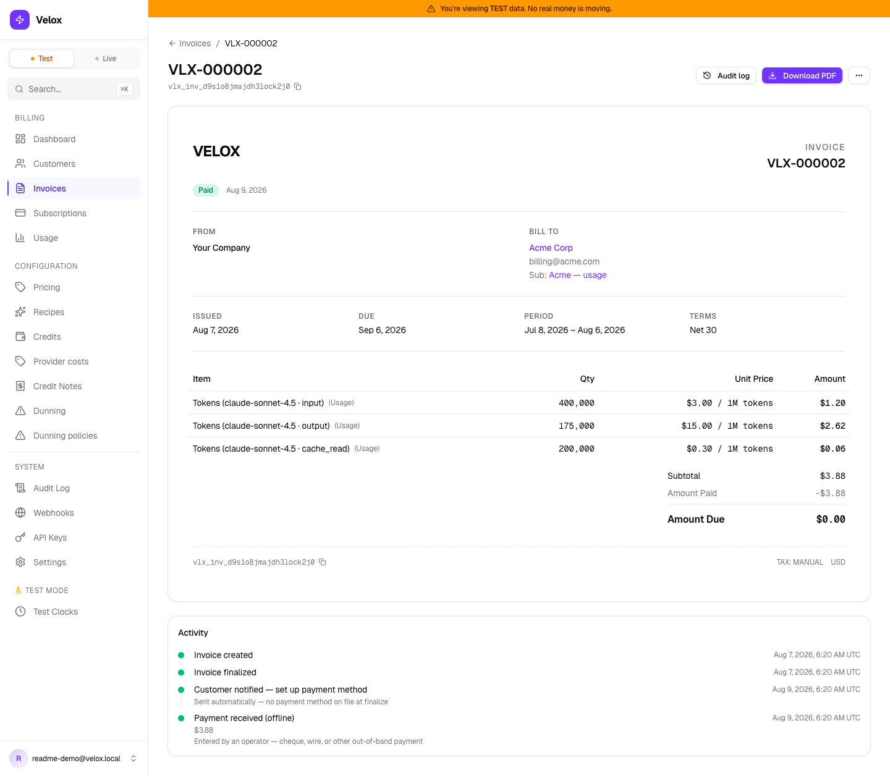

# Velox

### Meter every token. Sell prepaid commits. Know your margin.

**The open-source billing engine for AI and usage-heavy SaaS — runs in your own VPC.**

Velox owns the billing layer above the card charge: pricing, subscriptions, usage metering, invoicing, credits, and dunning (the automatic retry-and-escalate process that runs when a payment fails). Stripe still executes the card charge underneath, as a plain PaymentIntent. So the 0.5% Stripe Billing fee disappears, and your customers' billing data never leaves your infrastructure.

[](https://github.com/getvelox/velox/actions/workflows/ci.yml)
[](https://go.dev)
[](LICENSE)
[](CHANGELOG.md)

**Pre-1.0.** The public API is stabilising but not yet frozen. Until 1.0.0, breaking changes land on MINOR releases ([versioning policy](CHANGELOG.md)).

---

## What it looks like

Below is one meter with dimensioned events, and the invoice it produced a month later. `./scripts/demo.sh` generated it by running the whole flow against a real deployment in ~30 seconds:

```text
ACME Corp — VLX-000001                                    $3.88
──────────────────────────────────────────────────────────────
Tokens (claude-sonnet-4.5 · input)       400,000    →   $1.20
Tokens (claude-sonnet-4.5 · output)      175,000    →   $2.62
Tokens (claude-sonnet-4.5 · cache_read)  200,000    →   $0.06
──────────────────────────────────────────────────────────────
Margin (billed $3.88 vs provider cost $1.28)            67.1%
```



Three things happened there that most billing stacks can't do:

- **One meter carried every token dimension.** `model × token_type` live on the event. You do not need a separate meter for each combination.
- **Prices are decimal per-unit and read the way the industry quotes them.** They are stored exactly ($3.00 / 1M tokens = $0.000003/token) and billed linearly. The invoice, the hosted page, and the PDF display them per-1M.
- **The margin line is in-app.** Velox stamped the provider's cost onto every event at ingest. So "which customers lose us money?" is one API call, not a warehouse project.

**Jump to:** [Quick start](#quick-start) · [AI pricing in code](#ai-pricing-in-code) · [What's in the box](#whats-in-the-box) · [Benchmarks](#benchmarks) · [Why Velox exists](#why-velox-exists) · [How it fits](#how-it-fits) · [Will it take our volume?](#fewer-dependencies--but-will-it-take-our-volume) · [What Velox is not](#what-velox-is-not) · [Architecture](#architecture) · [Engineering](#engineering) · [Roadmap](#roadmap)

**All docs, by task, with a glossary:** [`docs/README.md`](docs/README.md). Billing terms used below (prepaid commit, drawdown, dunning, credit note, COGS) are defined in the [glossary](docs/README.md#glossary).

---

## Quick start

Prereqs: Docker, Go 1.26+, Node 22+ (dashboard), `jq` (demo script).

```bash
git clone https://github.com/getvelox/velox.git && cd velox

# Backend — Postgres + bootstrap demo tenant + operator user + API keys
cp .env.example .env # make dev reads it; the defaults work for local dev as-is
docker compose up -d postgres
make bootstrap       # prints operator email + password + secret-test, secret-live, publishable-test keys
make dev             # API on :8080

# Operator dashboard (separate terminal)
cd web-v2 && npm install && npm run dev
# → http://localhost:5173 — sign in with the email + password from bootstrap
```

Then run the end-to-end demo. In ~30 seconds it runs the whole flow:

- an Anthropic-style price matrix via one recipe call
- LiteLLM-shaped token ingest
- provider cost rates
- a test clock that simulates a full billing month
- a finalized invoice with per-`(model, token_type)` lines + PDF
- the margin report

```bash
./scripts/demo.sh <vlx_secret_test_... from make bootstrap>
```

Every call in the script is checked, and the script stops with an error at the first API mismatch. Rerun it as often as you like: each run creates a fresh demo customer on its own test clock.

**Outbound webhooks** can be tested locally without a tunnel:

- `python3 scripts/dev/webhook-sink.py` runs a receiver on `localhost:9099`.
- It logs every delivery with its `Velox-Signature` header, so you can verify the HMAC offline.
- Paths under `/fail` return 500, to exercise the retry ladder.
- Localhost delivery is allowed in development and refused in production.

To self-host for real, use single-VM Docker Compose: see [`docs/self-host.md`](docs/self-host.md). Running two or more replicas behind a load balancer is supported, because background jobs take leader leases (ADR-114). Only the packaging is deferred. Helm/Terraform will ship when a design partner names the Kubernetes flavour they run. The reason: shipping three deployment shapes in advance produced surface nobody was running.

---

## AI pricing in code

In five steps, with no Stripe Billing objects, you can:

- bill Anthropic-style multi-dimensional pricing with **one meter**,
- sell a prepaid commit (an up-front purchase of usage credit) against it,
- and read per-customer margin.

The API comes from `make dev` and the key from `make bootstrap` (see [Quick start](#quick-start)).

```bash
# 1. Create one meter for "tokens"
curl -X POST http://localhost:8080/v1/meters \
  -H "Authorization: Bearer $VELOX_SECRET" \
  -d '{"key": "tokens", "name": "LLM tokens", "unit": "token"}'

# 2. Ingest events that carry the dimensions inline
curl -X POST http://localhost:8080/v1/usage-events \
  -H "Authorization: Bearer $VELOX_SECRET" \
  -H "Idempotency-Key: req_8f2c..." \
  -d '{
    "event_name": "tokens",
    "external_customer_id": "cust_acme",
    "quantity": "12450",
    "dimensions": {"model": "gpt-4", "token_type": "input"}
  }'

# 3. Define one pricing rule per (dimension subset, rate)
curl -X POST http://localhost:8080/v1/meters/$METER_ID/pricing-rules \
  -H "Authorization: Bearer $VELOX_SECRET" \
  -d '{
    "dimension_match": {"model": "gpt-4", "token_type": "input"},
    "rating_rule_version_id": "rrv_gpt4_input",
    "aggregation_mode": "sum",
    "priority": 100
  }'

# 4. Sell a $10k prepaid commit for $9k — the credit block funds when the
#    invoice finalizes, and usage draws it down
#    ($INVOICE_ID: a draft one-off invoice from POST /v1/invoices — elided for brevity)
curl -X POST http://localhost:8080/v1/invoices/$INVOICE_ID/line-items \
  -H "Authorization: Bearer $VELOX_SECRET" \
  -d '{"description": "Annual commit", "line_type": "add_on",
       "quantity": 1, "unit_amount_cents": 900000,
       "commit_granted_cents": 1000000}'
curl -X POST http://localhost:8080/v1/invoices/$INVOICE_ID/finalize \
  -H "Authorization: Bearer $VELOX_SECRET"

# 5. Know which customers lose you money — stamped provider COGS vs rated revenue
curl http://localhost:8080/v1/customers/$CUSTOMER_ID/margin \
  -H "Authorization: Bearer $VELOX_SECRET"
```

Already running a LiteLLM proxy? Skip step 2. Point its spend callback at `POST /v1/integrations/litellm/spend`, and every completion lands as dimensioned token events (`model`, `token_type`). Replays are deduped, and no SDK is needed. See [`docs/integrations/litellm.md`](docs/integrations/litellm.md).

Each event is claimed by at most one pricing rule: the highest-priority match (the priority + claim resolver), so nothing is double-counted.

- Token roles are disjoint, so each `{model, token_type}` maps to exactly one rule at equal priority.
- You can also mix a coarse catch-all rule (`{"model": "gpt-4"}`) with finer per-role rules. Priority decides which one claims each event.

The full design lives in [`docs/design-multi-dim-meters.md`](docs/design-multi-dim-meters.md): schema, aggregation semantics, decimal quantities, and all five aggregation modes.

---

## What's in the box

### AI/usage-native

- **Multi-dimensional meters**: one meter, N pricing rules, dimensions on every event.
- **LiteLLM drop-in**: the proxy spend callback becomes dimensioned token events, with idempotent replay dedupe. No SDK, no schema work.
- **Prepaid commits + drawdown**: sell "pay $9k, get $10k" as an invoice line. When the invoice finalizes, the balance is funded in one atomic step. Usage then draws it down (drawdown), promotional credits first ([ADR-078](docs/adr/)).
- **Per-customer margin in-app**:
  - Maintain provider rates once (`/v1/provider-costs`).
  - Every event is stamped with its cost at ingest.
  - `GET /v1/customers/{id}/margin` answers "which customers lose us money?" Revenue it can't attribute goes to an explicit `unattributed_revenue` bucket ([ADR-079](docs/adr/)).
- **Decimal quantities & rates**: `NUMERIC(38,12)` for fractional GPU-hours and partial tokens. Per-unit prices are decimal, so $3.00 / 1M tokens bills exactly, while invoice totals stay whole cents.
- **Per-rule aggregation modes**: `sum`, `count`, `last_during_period`, `last_ever`, `max`.
- **Pricing recipes**: one call instantiates products + prices + meters + dunning (`anthropic_style`, `openai_style`, `replicate_style`).
- **Customer cost visibility**: a per-customer usage/cost breakdown in the dashboard. There is also a token-authenticated public JSON endpoint your app can render ("$4.31 of GPT-4 today", with a projected bill). A packaged embeddable widget is roadmap, not shipped.

### Self-host first

- **One application process**: a single Go binary.
  - No queue broker, no worker fleet, no separate scheduler. Background jobs are goroutines and the job queue is a Postgres table, so there is one thing to deploy, restart and reason about.
  - The Compose file adds Postgres, Redis (distributed rate limiting only), the static dashboard and an nginx front door. That makes five containers, one of which is Velox.
  - Single VM, ~5 min from clone to invoice.
- **MIT, and nothing is gated**: no licence key, no premium tier, no feature that unlocks when you pay.
  - That includes dunning, the feature that recovers your failed payments.
  - This is a lasting commitment: the engine stays MIT, and nothing that exists today will ever move behind a key.
  - Check this against whatever else you are evaluating. Open-core billing engines commonly put dunning, SSO and RBAC behind a key. Velox has no SSO or RBAC to gate (see [What Velox is not](#what-velox-is-not)).
- **Nothing phones home**: no licence check, no telemetry, no analytics SDK. OpenTelemetry tracing exists and exports to *your* collector when you configure one.
- **Data sovereignty**: customer billing data never leaves your infrastructure. This transfers the compliance obligations to you; it does not remove them. "Self-hosted so it's compliant by default" is not a claim we'll make.
- **Append-only audit log**: tamper-evidence enforced by database triggers, not convention.
- **Row-Level Security**: one deployment cleanly serves N internal tenants.

### Stripe-grade primitives (already shipped)

- **Subscriptions**: trial state machine with atomic flips · pause-collection · scheduled cancellation · plan changes with proration (you're only charged for the part of the period each price was active).
- **Pricing & discounts**: per-customer price overrides · prepaid credit ledger drawn against usage. Coupons were deliberately cut, because AI-native peers converge on credits, not promo codes ([ADR-039](docs/adr/)).
- **Invoicing & collection**: PDF invoices · hosted invoice page with secure tokens · branded emails · dunning with a circuit breaker · invoice preview (`Invoice.upcoming` parity).
- **Spend controls**: hard-cap thresholds (on spend or on usage quantity) that can finalize an invoice mid-cycle.
- **Credits & refunds**: event-sourced credit ledger · credit notes (the formal "we owe you" document) with refunds.
- **Reliability & observability**:
  - Idempotency keys: retrying a request can never double-charge.
  - Transactional outbox: outbound webhook events commit in the same database transaction as the change that caused them, then a dispatcher delivers them. Customer emails are queued post-commit and delivered at-least-once from the queue.
  - Webhook signing with a 72h dual-signing rotation grace: during the window, both the old and the new secret sign every delivery.
  - A live webhook event tail with per-attempt delivery timelines.
  - Test clocks that simulate months of billing in seconds.

See [`CHANGELOG.md`](CHANGELOG.md) for the full ship log.

---

## Benchmarks

Two runs are published in full: method, gates, evidence, and what each one does *not* show.

**[Correctness under failure](docs/benchmarks/failure-correctness.md)**: what happens to your invoices when the billing process dies mid-run.

- **Scenarios.** A leader (the process elected to run the billing cycle) is `SIGKILL`ed at five kill points. The kill points are chosen by watching the database, not by sleeping. Four leaders race the same cycle at once. A partition drill severs a real network link to time the takeover.
- **Result.** **0 duplicate invoices, 0 lost invoices, 0 cents of drift.** The money-invariant doctor is clean after every scenario.
- **Negative control.** This is what makes the result a measurement rather than a claim. Drop `idx_invoices_billing_idempotency`, and the same run bills **103 invoices for 40 periods, $2,575 against $1,000 of real periods, with every leader reporting success.**
- **Reproduce.** From a clean checkout with Docker and two `go test` commands.

**[Sustained throughput](docs/benchmarks/sustained-throughput.md)**: what the ingest path holds on named AWS hardware, with every event reconciled against Postgres.

- A run whose sent count does not match the rows stored is discarded rather than reported.
- The headline figures and the capacity cliffs are in [Will it take our volume?](#fewer-dependencies--but-will-it-take-our-volume) below.
- The doc adds the method, the `pgbench` control denominator, and the *What this does not show* section.
- It also gives the closed-loop ceilings. Each sender waits for a response before sending again, so these are maxima, not service levels.
- It states the two defects the runs found in Velox itself beside the numbers, rather than fixing them quietly. Both are linked with their numbers in [the volume section](#fewer-dependencies--but-will-it-take-our-volume).

---

## Why Velox exists

Velox is built around three market needs that Stripe Billing structurally cannot serve, plus one that every billing system is judged on.

**1. AI apps price in dimensions, not units.**

- Real model pricing today is `model × token_type × tier`. `token_type` alone has five disjoint roles (`input`, `output`, `cache_read`, `cache_write_5m`, `cache_write_1h`).
- Stripe's Meter API forces one meter per dimension *combination*. Modelling a single LLM's pricing then takes a wall of meters and ugly subscription wiring.
- Velox puts dimensions on the event and lets one meter carry them all.
- If you already run a [LiteLLM](docs/integrations/litellm.md) proxy, its spend callback ingests straight into Velox, with no SDK.

**2. AI infra sells commit + usage.**

- "Pay $9k up front, get $10k of usage to draw down" is the default AI-infra contract (a prepaid commit).
- Stripe Billing has no commit primitive. The engines that do (Orb, Metronome) are closed-source SaaS.
- In Velox a commit is one line on an invoice. When the invoice finalizes, the prepaid balance is funded in one atomic step. Usage drains it, promotional credits first.
- `credit.balance_low / _depleted / _recovered` webhooks drive your top-up nudges.

**3. Regulated businesses can't ship billing data to Stripe's servers.**

- Examples: GDPR-strict EU, India's RBI data-localization rules, healthcare-adjacent SaaS, government procurement.
- Stripe's whole model is "send us the data."
- Velox runs in your VPC. One deployment cleanly serves many internal tenants behind Postgres Row-Level Security.
- The binary makes no outbound calls of its own: no licence check, no usage telemetry, no vendor endpoint. You can confirm this by searching the source.

**4. Every bill gets disputed, and the only answer is the raw events.**

Ask engineers who have run metered billing what vendors get wrong. This is what comes back:

> *"you will get a query on a bill by a customer… and you need to be able to dig into the raw data… to validate there was no billing error."*

Velox is built for that moment:

- Raw events are stored, never pre-aggregated away.
- The rate is **snapshotted onto the invoice line**, so re-pricing tomorrow can't silently rewrite what you billed last month.
- Every usage line links straight to the events behind it, filtered to that customer, meter and period.
- The audit log is append-only, enforced by database triggers rather than convention.

---

## How it fits

|                          | **Velox** | Stripe Billing | Lago        | Orb / Metronome¹  | OpenMeter²        |
|--------------------------|-----------|----------------|-------------|-------------------|-------------------|
| OSS / self-host          | ✅        | ❌             | ✅          | ❌                | ✅                |
| AI-native pricing        | ✅        | ❌             | ⚠️ generic  | ⚠️ closed source  | ⚠️ metering-first |
| Full billing engine      | ✅        | ✅             | ✅          | ✅                | ✅ beta           |
| Stripe-grade primitives  | ✅        | ✅             | ⚠️          | ✅                | ⚠️                |
| Prepaid commits + drawdown | ✅      | ❌             | ⚠️ wallets  | ✅                | ❌                |
| Per-customer margin (COGS) | ✅ in-app | ❌           | ❌          | ❌ warehouse join | ⚠️ cost, no margin |
| Pricing                  | OSS       | 0.5% of GMV    | OSS / cloud | sales-gated       | OSS / cloud       |
| Licence                  | MIT       | proprietary    | AGPL-3.0    | proprietary       | Apache-2.0        |
| Dunning without paying³  | ✅        | ✅             | ❌          | ✅                | ⚠️ Stripe Invoicing |
| Data sovereignty         | ✅        | ❌             | ⚠️          | ❌                | ✅                |

¹ Metronome was acquired by Stripe (Jan 2026). It is still SaaS-only, so your billing data lives on Stripe's servers either way.

² OpenMeter ([acquired by Kong](https://konghq.com/blog/news/kong-acquires-openmeter), Sep 2025) now runs a full invoice lifecycle; billing is marked beta. It ships LLM cost tables with a per-feature, per-customer cost query. That is cost, not margin: nothing subtracts it from revenue. The difference is shape:

- It runs on Kafka + ClickHouse + Postgres.
- It has no dunning of its own. Collection is handed to Stripe Invoicing (Stripe's percentage fee applies), or to a custom-invoicing integration you build.

Everything in this footnote was checked against the OpenMeter source on 2026-09-28.

³ Open-core self-hosting isn't automatically free of gates. Lago's self-hosted edition checks a `LAGO_LICENSE` key against their licence server. A 30-entry `PREMIUM_INTEGRATIONS` list decides what's enabled. `auto_dunning` is on it, alongside SSO, RBAC, progressive billing and every accounting/CRM integration ([source](https://github.com/getlago/lago-api/blob/main/app/models/organization.rb)). Velox has no licence key and gates nothing. One caveat: some of what Lago gates (SSO, RBAC, revenue recognition) Velox simply doesn't have. See [What Velox is not](#what-velox-is-not).

**Verified as of 2026-08-17.** On the pricing row, neither Orb nor Metronome publishes an annual list price:

- Orb's three tiers all read "Custom pricing" behind Contact Sales ([pricing](https://www.withorb.com/pricing)).
- Metronome publishes a Starter rate: 0.8% of billing volume plus $0.04 per 1k ingest events. Its Custom tier is behind sales ([pricing](https://metronome.com/pricing)).

Competitor pricing, licensing and ownership all move. Re-check any cell you plan to rely on.

Velox lives in the empty cell: **OSS + self-host + AI-native + full billing engine.**

The decision tree:

- Pick **Stripe Billing** (or Stripe + Metronome) for hosted SaaS billing.
- Pick **Lago** for generic OSS billing without AI-shaped pricing.
- Pick **Orb/Metronome** if you can't self-host and can budget for usage-based contracts.
- Pick **Velox** when you need AI-native billing that runs in your own VPC.

---

## “Fewer dependencies” — but will it take our volume?

It is a fair question, and the answer has three parts.

**Where the Postgres-only ceiling actually is.**

Lago is the closest comparable, and it *does* ship a Kafka + ClickHouse tier. It routes everything under **10,000 events/sec** to its ordinary REST API, batched above ~1,000/s. It only recommends streaming above that, noting that *"Many customers start on REST and switch to Kafka only when they outgrow it."*

Their 10,000/sec reference point is one self-hosted deployment they describe but don't name. To their credit, they publish the whole story rather than only the flattering half: *"A major global payments company runs Lago self-hosted, processing thousands of transactions per second. They started on Postgres (validated at 10K events/sec) and later migrated to ClickHouse + Kafka for higher throughput …"* ([source](https://docs.getlago.com/guide/events/ingesting-usage), verified 2026-08-17).

So 10k/sec is where a Postgres-first billing stack stops being obviously sufficient, not where it stops working. Ten thousand a second is roughly 26 billion events a month. An AI product metering LLM calls at one to three events each reaches billions of API calls a month before the architecture is the constraint.

**What we have actually measured, and what we haven't.**

Conditions: AWS, one AZ, the live-mode path, 200 customers, and every event reconciled against the database.

| Instance | Load | p99 | Held |
|---|---|---|---|
| `db.m7g.2xlarge` (32 GB) | **1,000 events/sec** | **8.2 ms** | **across five 10-minute repeats** |
| same instance | 5,000 ev/s | 51 ms | until the table's index working set (~60M rows, 30 GB) outgrew the instance: a capacity cliff stated with its numbers |
| `db.m7g.4xlarge` (64 GB), after fixing the hot row the first run found ([#818](https://github.com/getvelox/velox/issues/818)) | **12,000 ev/s at batch 10 (1,200 requests/s)** | **22.6 ms** | each 4 of 5 ten-minute repeats |
| same instance, same run | **15,000 ev/s at batch 100** | **43.8 ms** | same as the row above |
| same instance, third instrumented run, WAL segment pool sized as the runbook now says | 12,000 ev/s | worst 10-second p99 of 52 ms | **5 of 5** |

- The third run caught the tail stalls live: WAL segment creation when RDS's recycled-segment pool runs dry.
- The runs also found the per-customer usage summary that scans linearly ([#819](https://github.com/getvelox/velox/issues/819)). It is stated beside the numbers.
- [`docs/benchmarks/sustained-throughput.md`](docs/benchmarks/sustained-throughput.md) carries the method, the gates, the evidence files, the closed-loop ceilings and pgbench denominators.
- It also has a plain list of what was *not* tested: steady traffic only, 10-minute windows, single AZ.
- The whole thing reproduces with one command from `scripts/bench-rig/`.

**The ladder, which stays boring for a long time.** Before Velox needs a new dependency, these steps come first:

1. Use the batch endpoint. One database commit spreads the write cost across up to 1,000 events.
2. Add replicas (multi-replica leader leases already ship).
3. Partition `usage_events` by month.
4. Set a retention window on raw events.
5. Move analytics to a read replica.

Each rung is ordinary Postgres operations. A columnar store only earns its place in two cases: you want arbitrary slicing over years of raw events, or sustained ingest well past the figure above. At that point it belongs beside Velox as a read-side sidecar, not underneath it. Money never leaves Postgres.

**And if you already run Kafka, keep it.** Velox does not want to own your transport. Point a consumer at the batch ingest endpoint, and your existing pipeline feeds it directly. Teams already use this shape to avoid duplicating a metering stack they consider core. Velox is deliberately the last mile: rating, invoicing, credits, dunning, collection.

One structural note makes all of the above easier than it looks. Velox scales as many separate deployments, not one shared cluster. Every company running Velox runs its own deployment, carrying only its own volume. So the aggregate pressure that forces a shared SaaS platform onto Kafka never accumulates in any single instance.

---

## What Velox is **not**

Read this list to decide quickly whether Velox fits you:

- **Not for vanilla card-first SaaS** with simple per-seat pricing. Stripe Billing is fine for them.
- **Not multi-PSP (payment service provider) yet.** Stripe is the only payment processor. Razorpay/Adyen come when a paying tenant asks.
- **Not for marketplaces or Stripe Connect.** Velox bills *your* customers directly; it doesn't split payouts across sub-merchants. Velox itself is multi-tenant (many billing tenants per deployment), but each tenant collects on its own behalf.
- **No Revenue Recognition / Sigma** (Stripe's revenue-accounting and SQL-analytics products). Bring your own warehouse + dbt.
- **No Quotes or Subscription Schedules.** Sales-led contract billing should pick Recurly or Maxio.
- **No 50+ payment-method types.** Cards via Stripe + send-invoice. ACH/SEPA expand from there.

---

## Architecture

One Go binary, one package per domain. Each domain owns its store, service and handler;
a billing engine coordinates them, Postgres Row-Level Security isolates tenants, and
Stripe only executes the card charge. Package layout and design rules:
[`docs/architecture.md`](docs/architecture.md).

ADRs explaining the load-bearing decisions live in [`docs/adr/`](docs/adr/).

---

## Engineering

The short version for engineers new to the repo, with the evidence: [`docs/ENGINEERING.md`](docs/ENGINEERING.md).

Velox moves money, so correctness is the product, not a feature. The disciplines that show up in the code:

- **Money-path changes follow a written protocol, not judgment.** Any change to an invoice, payment, credit, or state machine goes through the [money-path robustness playbook](docs/dev/money-path-robustness-playbook.md). Before writing a line, you enumerate the state's *complete* site-set: every writer, effect-firer, gated reader and crash point. Local reasoning is exactly how money bugs ship.
- **Invariants are enforced by machines, not convention.**
  - Tenant isolation is Postgres RLS, proven by tests that fail if a query escapes its tenant.
  - Exactly-once auto-charge is a compare-and-swap claim that holds through a dual-leader failover.
  - A new cross-domain import fails the architecture test until justified in an allowlist; `time.Now()` on a clock-pinned entity (one whose time comes from a test clock, not the wall clock) fails a lint.
  - A **money-invariant doctor** (`cmd/velox-doctor`) sweeps the whole database for 30 states no legal writer can produce. It runs in CI after every integration pass. It also runs inside a 13-month billing soak, which closes a subscription month thirteen times through the real server and demands a clean sweep after every close.
  - The rule behind all of these: if a mistake can recur, a machine catches the next one.
- **Failure modes are measured, not asserted.**
  - "Crash-safe" and "idempotent" are the two easiest things in billing to claim and the two hardest to check. So both are published as runs with a negative control, not as design notes. See [Benchmarks](#benchmarks).
  - Where the money math has more cases than anyone can enumerate by hand, the tests generate them: billing dates ([`internal/domain/billing_dates_property_test.go`](internal/domain/billing_dates_property_test.go)), pricing ([`internal/domain/pricing_property_test.go`](internal/domain/pricing_property_test.go)), proration ([`internal/subscription/proration_property_test.go`](internal/subscription/proration_property_test.go)), tax apportionment ([`internal/tax/apportionment_property_test.go`](internal/tax/apportionment_property_test.go)), and the credit waterfall ([`internal/credit/waterfall_property_integration_test.go`](internal/credit/waterfall_property_integration_test.go)).
  - The operational paths that only ever fail in production are drilled on purpose. [`scripts/partition-drill.sh`](scripts/partition-drill.sh) severs a real network link and measures how long a dead leader's lock stays stranded. [`scripts/restore-drill.sh`](scripts/restore-drill.sh) runs the whole backup → restore → row-count-validate loop against an ephemeral Postgres. [`scripts/migration-safety-test.sh`](scripts/migration-safety-test.sh) replays the migration set against a populated database, to catch the lock a migration would take at scale.
- **The database is never mocked.** Every test that touches a database touches real Postgres: ~104k lines of Go test code against ~102k of production Go. So a green suite means migrations, RLS, and the money math work end-to-end. That includes concurrent-claimer collision tests and mutation-verified assertions (break the logic on purpose; the test must fail).
- **Decisions are written down, including the reversals.** [110+ ADRs](docs/adr/) record the load-bearing calls and the reversals. For example, a per-subscription timezone snapshot was built, shipped, then *deleted* once org-level proved the complete abstraction (ADR-074 → 077). When a design keeps spawning guard machinery, the model is treated as wrong, not the guards as missing.
- **Audited like production, pre-launch.** A [117-finding end-to-end audit](docs/dev/audit-2026-07-02-full-product.md) was remediated in gated PRs. An [HA-readiness audit](docs/dev/ha-readiness-2026-07-06.md) names every single-point-of-failure before the word "production" gets used.

---

## API surface

The core routes at a glance: [`docs/api-surface.md`](docs/api-surface.md).
The reference is [`api/openapi.yaml`](api/openapi.yaml); webhook consumers
start at [`docs/webhooks.md`](docs/webhooks.md); key types, rotation, and
adding tenants: [`docs/api-keys.md`](docs/api-keys.md).

---

## Roadmap

### Recently shipped

July–August 2026:

- prepaid commits + drawdown
- provider cost tables with in-app per-customer margin
- team invites (ADR-081)
- ambiguous-charge safety (ADR-105–108)
- bad-debt semantics (ADR-110–113)
- a 30-check money-invariant sweep in CI
- multi-replica leader leases (ADR-114): every background job takes a per-tick lease that every claim re-checks. So a dead replica is replaced in seconds, and a transaction-mode pooler is safe.

Dated detail: [`CHANGELOG.md`](CHANGELOG.md).

### Explicitly deferred (on hold pending design partner)

- Helm chart + Terraform AWS module. Multi-replica HA itself is no longer deferred: as of 2026-08-30, N ≥ 2 behind a load balancer is the supported production posture, and the engine is being built for it. See [`docs/dev/ha-readiness-2026-07-06.md`](docs/dev/ha-readiness-2026-07-06.md).
- Stripe Billing migration tool (`velox-import`)
- SOC 2 / GDPR-deletion / audit-log retention enterprise-readiness docs
- RBAC / role enforcement. Invites shipped with every member holding full access; role-scoped permissions land when a design partner names the split. The SSO direction is predetermined: embedded OIDC/SAML in-process, never a SaaS auth vendor.
- Operator polish: bulk actions, billing-alerts UI, plan-migration cohort UI, embedded dashboard docs site

These are paused, not killed. They land when a real customer names the specific shape they need; pre-launch builds optimise the wrong version of each.

---

## Tech stack

**Backend** — Go 1.26, chi/v5 router, PostgreSQL 16 with RLS, `shopspring/decimal` for money, `signintech/gopdf` for invoices, Prometheus metrics.

**Frontend** — React 19, TypeScript, Vite, TailwindCSS, shadcn/ui, Lucide icons.

**Payments** — Stripe (PaymentIntents + Checkout Sessions). No Stripe Billing dependency.

---

## Running tests

```bash
make test                # unit tests only
make test-integration    # full integration suite (needs Postgres)
```

Integration tests exercise real Postgres with RLS enforced — no sqlmock, no mock framework in the repo (see [Engineering](#engineering)).

---

## Community & support

- **Questions / evaluating a deployment:** [GitHub Discussions](https://github.com/getvelox/velox/discussions)
- **Bugs:** [Issues](https://github.com/getvelox/velox/issues) — money-path bugs triaged first
- **Security:** see [`SECURITY.md`](SECURITY.md) — private disclosure, not a public issue

---

## Contributing

Velox is open source under MIT. Contributions welcome — see [`CONTRIBUTING.md`](CONTRIBUTING.md). Major features land with a design RFC alongside the code, so the reasoning is reviewable before the implementation is; read any `docs/design-*.md` or the [ADRs](docs/adr/) for the pattern.

Running AI inference, a vector DB, or usage-heavy SaaS, and Stripe Billing is starting to limit you? Open an issue — happy to help you get a self-hosted deployment going.

---

## License

[MIT](LICENSE)
